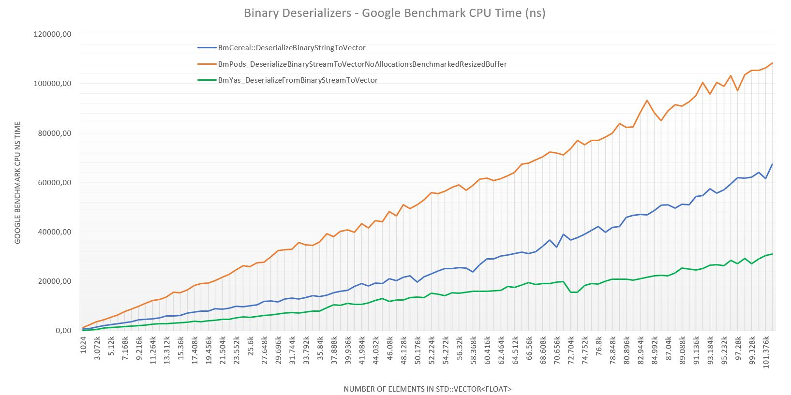
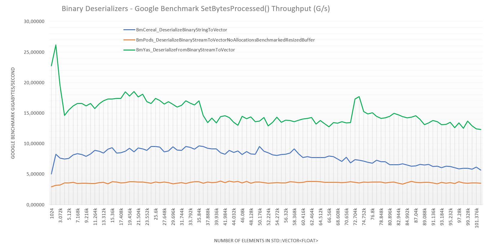

<p align="right">
  
</p>

# Benchmarks ***compare.py*** - Tool Execution

## References

* Google Benchmark tools <https://github.com/google/benchmark/blob/main/docs/tools.md>

## Related docs

* [Main Readme](./../README.md)
* [Tool Preparation](./TOOL_PREPARATION.md)

## System dependencies

* Tested in Ubuntu 20.04 LTS
* Tested with Python 3.8

## Execution

As in Google Benchmark reference tool documentation explains, **compare.py** tool can be used in various modes. Due to our benchmark design to this use case, all benchmarked code must be executed sequentially. 

This means first mode of operation is now valid for this use case because we can not ouput a file for family benchmarks about **Cereal__Retrive_float_vector_from_disk_jsonfile** and a new and independent one for family benchmarks **Simdjon__Retrive_using__get_array_double__without_count_elements_from_disk_jsonfile**, as instance.

As we need to create whole ouput file in same execution due to dependencies created in firsts family benchmmarks, we will use mode 2 of operation as follows.

### Step 1 - Create ouput results file

```bash
jose@ubuntu:~/klepsydra/klepsydra/development/community/kpsr-core-benchmarks/build$ ./bin/kpsr_benchmark_json_test --benchmark_counters_tabular=true --benchmark_out=bm.out
```

Once this commad is executed, **bm.out** specified name file will be created in root execution folder.

### Step 2 - Execute ***./compare.py*** script tool

In below example command, we have located into benchmarks/tool folder to have **compare.py** tool in root execution folder.

```bash
jose@ubuntu:~/klepsydra/klepsydra/development/community/kpsr-core-benchmarks/thirdparties/benchmark/tools$ 
./compare.py filters 
../../../build/bm.out 
BmCereal::DeserializeBinaryStringToVector 
BmYas::DeserializeFromBinaryStreamToVector
Comparing BmCereal::DeserializeBinaryStringToVector to BmYas::DeserializeFromBinaryStreamToVector (from ../../../build/bm.out)
Benchmark                                                                                                                     Time             CPU      Time Old      Time New       CPU Old       CPU New
----------------------------------------------------------------------------------------------------------------------------------------------------------------------------------------------------------
[BmCereal::DeserializeBinaryStringToVector vs. BmYas::DeserializeFromBinaryStreamToVector]/1024/real_time                  -0.7654         -0.7654           747           175           747           175
[BmCereal::DeserializeBinaryStringToVector vs. BmYas::DeserializeFromBinaryStreamToVector]/10240/real_time                 -0.3694         -0.3693          3946          2488          3945          2488
[BmCereal::DeserializeBinaryStringToVector vs. BmYas::DeserializeFromBinaryStreamToVector]/19456/real_time                 -0.4528         -0.4529          7297          3993          7296          3992
[BmCereal::DeserializeBinaryStringToVector vs. BmYas::DeserializeFromBinaryStreamToVector]/28672/real_time                 -0.4125         -0.4124         11095          6519         11093          6518
[BmCereal::DeserializeBinaryStringToVector vs. BmYas::DeserializeFromBinaryStreamToVector]/37888/real_time                 -0.2019         -0.2020         12808         10222         12804         10217
[BmCereal::DeserializeBinaryStringToVector vs. BmYas::DeserializeFromBinaryStreamToVector]/47104/real_time                 -0.3082         -0.3082         19153         13250         19146         13245
[BmCereal::DeserializeBinaryStringToVector vs. BmYas::DeserializeFromBinaryStreamToVector]/56320/real_time                 -0.3338         -0.3337         22680         15110         22675         15110
[BmCereal::DeserializeBinaryStringToVector vs. BmYas::DeserializeFromBinaryStreamToVector]/65536/real_time                 -0.3867         -0.3868         28578         17526         28575         17523
[BmCereal::DeserializeBinaryStringToVector vs. BmYas::DeserializeFromBinaryStreamToVector]/74752/real_time                 -0.4838         -0.4838         36872         19033         36866         19029
[BmCereal::DeserializeBinaryStringToVector vs. BmYas::DeserializeFromBinaryStreamToVector]/83968/real_time                 -0.4992         -0.4991         42423         21245         42407         21241
[BmCereal::DeserializeBinaryStringToVector vs. BmYas::DeserializeFromBinaryStreamToVector]/93184/real_time                 -0.5244         -0.5242         55127         26221         55102         26218
[BmCereal::DeserializeBinaryStringToVector vs. BmYas::DeserializeFromBinaryStreamToVector]/102400/real_time                -0.5547         -0.5545         69804         31085         69768         31083
OVERALL_GEOMEAN                                                                                                            -0.4621         -0.4620             0             0             0             0
jose@ubuntu:~/klepsydra/klepsydra/development/kpsr-core-benchmarks_pushed/thirdparties/benchmark/tools$ 
...
...

```

NOTE: Required to have a fully working **./compare.py** tool script as specified in help steps provided in [Tool Preparation](./TOOL_PREPARATION.md).

### Step 3 - Result analysis

Is responsability of the final user to execute filter comparisons between families and results with some sense. In this case, has been choiced families which both makes file disk access and benchmark families are both expressed for the exactly same DenseRanges obtaining same vector size for each row to be compared.

This results seems tell us use of SimdJSON to deserialize JSON files has best performance than Cereal deserialze.

**NOTE:** To be remembered that values in Time and CPU columns are calculated as **(new - old) / |old|**.

## Results obtained

**NOTE**: results stored in bm_results_full.out &  bm_results_full.txt.

## Quick chart view

<p float="left">
  
  
</p>

### compare between **BmCereal::DeserializeBinaryStringToVector vs. BmYas::DeserializeFromBinaryStreamToVector**
 
```bash
jose@ubuntu:~/klepsydra/klepsydra/development/kpsr-core-benchmarks_pushed/thirdparties/benchmark/tools$ 
./compare.py filters 
../../../build/bm.out 
BmCereal::DeserializeBinaryStringToVector 
BmYas::DeserializeFromBinaryStreamToVector
Comparing BmCereal::DeserializeBinaryStringToVector to BmYas::DeserializeFromBinaryStreamToVector (from ../../../build/bm.out)
Benchmark                                                                                                                     Time             CPU      Time Old      Time New       CPU Old       CPU New
----------------------------------------------------------------------------------------------------------------------------------------------------------------------------------------------------------
[BmCereal::DeserializeBinaryStringToVector vs. BmYas::DeserializeFromBinaryStreamToVector]/1024/real_time                  -0.7790         -0.7791           760           168           760           168
[BmCereal::DeserializeBinaryStringToVector vs. BmYas::DeserializeFromBinaryStreamToVector]/2048/real_time                  -0.6836         -0.6835           922           292           922           292
[BmCereal::DeserializeBinaryStringToVector vs. BmYas::DeserializeFromBinaryStreamToVector]/3072/real_time                  -0.6085         -0.6085          1499           587          1498           587
[BmCereal::DeserializeBinaryStringToVector vs. BmYas::DeserializeFromBinaryStreamToVector]/4096/real_time                  -0.4899         -0.4899          2047          1044          2047          1044
[BmCereal::DeserializeBinaryStringToVector vs. BmYas::DeserializeFromBinaryStreamToVector]/5120/real_time                  -0.5122         -0.5122          2522          1230          2521          1230
[BmCereal::DeserializeBinaryStringToVector vs. BmYas::DeserializeFromBinaryStreamToVector]/6144/real_time                  -0.4977         -0.4977          2816          1415          2815          1414
[BmCereal::DeserializeBinaryStringToVector vs. BmYas::DeserializeFromBinaryStreamToVector]/7168/real_time                  -0.4941         -0.4942          3191          1614          3190          1614
[BmCereal::DeserializeBinaryStringToVector vs. BmYas::DeserializeFromBinaryStreamToVector]/8192/real_time                  -0.5042         -0.5042          3720          1844          3719          1844
[BmCereal::DeserializeBinaryStringToVector vs. BmYas::DeserializeFromBinaryStreamToVector]/9216/real_time                  -0.5098         -0.5097          4335          2125          4334          2125
[BmCereal::DeserializeBinaryStringToVector vs. BmYas::DeserializeFromBinaryStreamToVector]/10240/real_time                 -0.4979         -0.4980          4592          2306          4592          2305
[BmCereal::DeserializeBinaryStringToVector vs. BmYas::DeserializeFromBinaryStreamToVector]/11264/real_time                 -0.4356         -0.4356          4720          2664          4719          2663
[BmCereal::DeserializeBinaryStringToVector vs. BmYas::DeserializeFromBinaryStreamToVector]/12288/real_time                 -0.4708         -0.4708          5230          2768          5230          2768
[BmCereal::DeserializeBinaryStringToVector vs. BmYas::DeserializeFromBinaryStreamToVector]/13312/real_time                 -0.5046         -0.5047          5884          2915          5884          2914
[BmCereal::DeserializeBinaryStringToVector vs. BmYas::DeserializeFromBinaryStreamToVector]/14336/real_time                 -0.4756         -0.4756          5893          3090          5893          3090
[BmCereal::DeserializeBinaryStringToVector vs. BmYas::DeserializeFromBinaryStreamToVector]/15360/real_time                 -0.4614         -0.4614          6134          3304          6133          3304
[BmCereal::DeserializeBinaryStringToVector vs. BmYas::DeserializeFromBinaryStreamToVector]/16384/real_time                 -0.5146         -0.5147          7232          3510          7232          3510
[BmCereal::DeserializeBinaryStringToVector vs. BmYas::DeserializeFromBinaryStreamToVector]/17408/real_time                 -0.5111         -0.5110          7625          3728          7623          3728
[BmCereal::DeserializeBinaryStringToVector vs. BmYas::DeserializeFromBinaryStreamToVector]/18432/real_time                 -0.5278         -0.5279          7874          3718          7874          3718
[BmCereal::DeserializeBinaryStringToVector vs. BmYas::DeserializeFromBinaryStreamToVector]/19456/real_time                 -0.4811         -0.4810          7846          4071          7844          4071
[BmCereal::DeserializeBinaryStringToVector vs. BmYas::DeserializeFromBinaryStreamToVector]/20480/real_time                 -0.5332         -0.5331          8815          4115          8814          4115
[BmCereal::DeserializeBinaryStringToVector vs. BmYas::DeserializeFromBinaryStreamToVector]/21504/real_time                 -0.4754         -0.4754          8654          4539          8652          4539
[BmCereal::DeserializeBinaryStringToVector vs. BmYas::DeserializeFromBinaryStreamToVector]/22528/real_time                 -0.4938         -0.4938          9180          4647          9179          4647
[BmCereal::DeserializeBinaryStringToVector vs. BmYas::DeserializeFromBinaryStreamToVector]/23552/real_time                 -0.4733         -0.4733          9869          5198          9867          5197
[BmCereal::DeserializeBinaryStringToVector vs. BmYas::DeserializeFromBinaryStreamToVector]/24576/real_time                 -0.4249         -0.4250          9622          5533          9620          5532
[BmCereal::DeserializeBinaryStringToVector vs. BmYas::DeserializeFromBinaryStreamToVector]/25600/real_time                 -0.4534         -0.4534         10023          5479         10021          5478
[BmCereal::DeserializeBinaryStringToVector vs. BmYas::DeserializeFromBinaryStreamToVector]/26624/real_time                 -0.4488         -0.4486         10547          5814         10543          5813
[BmCereal::DeserializeBinaryStringToVector vs. BmYas::DeserializeFromBinaryStreamToVector]/27648/real_time                 -0.4737         -0.4735         11892          6259         11887          6258
[BmCereal::DeserializeBinaryStringToVector vs. BmYas::DeserializeFromBinaryStreamToVector]/28672/real_time                 -0.4787         -0.4786         12138          6327         12133          6326
[BmCereal::DeserializeBinaryStringToVector vs. BmYas::DeserializeFromBinaryStreamToVector]/29696/real_time                 -0.4230         -0.4230         11681          6740         11676          6738
[BmCereal::DeserializeBinaryStringToVector vs. BmYas::DeserializeFromBinaryStreamToVector]/30720/real_time                 -0.4412         -0.4412         12803          7155         12801          7153
[BmCereal::DeserializeBinaryStringToVector vs. BmYas::DeserializeFromBinaryStreamToVector]/31744/real_time                 -0.4522         -0.4523         13280          7275         13279          7273
[BmCereal::DeserializeBinaryStringToVector vs. BmYas::DeserializeFromBinaryStreamToVector]/32768/real_time                 -0.4408         -0.4408         12847          7183         12846          7183
[BmCereal::DeserializeBinaryStringToVector vs. BmYas::DeserializeFromBinaryStreamToVector]/33792/real_time                 -0.4363         -0.4364         13440          7576         13438          7573
[BmCereal::DeserializeBinaryStringToVector vs. BmYas::DeserializeFromBinaryStreamToVector]/34816/real_time                 -0.4418         -0.4417         14249          7953         14243          7951
[BmCereal::DeserializeBinaryStringToVector vs. BmYas::DeserializeFromBinaryStreamToVector]/35840/real_time                 -0.4350         -0.4348         13887          7846         13880          7845
[BmCereal::DeserializeBinaryStringToVector vs. BmYas::DeserializeFromBinaryStreamToVector]/36864/real_time                 -0.3485         -0.3485         14407          9386         14405          9384
[BmCereal::DeserializeBinaryStringToVector vs. BmYas::DeserializeFromBinaryStreamToVector]/37888/real_time                 -0.3148         -0.3149         15311         10491         15310         10489
[BmCereal::DeserializeBinaryStringToVector vs. BmYas::DeserializeFromBinaryStreamToVector]/38912/real_time                 -0.3547         -0.3547         15861         10235         15855         10232
[BmCereal::DeserializeBinaryStringToVector vs. BmYas::DeserializeFromBinaryStreamToVector]/39936/real_time                 -0.3180         -0.3181         16270         11096         16267         11092
[BmCereal::DeserializeBinaryStringToVector vs. BmYas::DeserializeFromBinaryStreamToVector]/40960/real_time                 -0.4096         -0.4097         17922         10580         17922         10578
[BmCereal::DeserializeBinaryStringToVector vs. BmYas::DeserializeFromBinaryStreamToVector]/41984/real_time                 -0.4348         -0.4347         19015         10747         19007         10745
[BmCereal::DeserializeBinaryStringToVector vs. BmYas::DeserializeFromBinaryStreamToVector]/43008/real_time                 -0.3780         -0.3779         18076         11244         18073         11243
[BmCereal::DeserializeBinaryStringToVector vs. BmYas::DeserializeFromBinaryStreamToVector]/44032/real_time                 -0.3675         -0.3672         19235         12167         19226         12166
[BmCereal::DeserializeBinaryStringToVector vs. BmYas::DeserializeFromBinaryStreamToVector]/45056/real_time                 -0.3239         -0.3240         19135         12937         19130         12932
[BmCereal::DeserializeBinaryStringToVector vs. BmYas::DeserializeFromBinaryStreamToVector]/46080/real_time                 -0.4335         -0.4336         20981         11887         20979         11883
[BmCereal::DeserializeBinaryStringToVector vs. BmYas::DeserializeFromBinaryStreamToVector]/47104/real_time                 -0.3833         -0.3833         20247         12485         20239         12481
[BmCereal::DeserializeBinaryStringToVector vs. BmYas::DeserializeFromBinaryStreamToVector]/48128/real_time                 -0.4231         -0.4233         21620         12472         21620         12469
[BmCereal::DeserializeBinaryStringToVector vs. BmYas::DeserializeFromBinaryStreamToVector]/49152/real_time                 -0.3936         -0.3935         22203         13465         22197         13462
[BmCereal::DeserializeBinaryStringToVector vs. BmYas::DeserializeFromBinaryStreamToVector]/50176/real_time                 -0.3029         -0.3031         19588         13655         19585         13648
[BmCereal::DeserializeBinaryStringToVector vs. BmYas::DeserializeFromBinaryStreamToVector]/51200/real_time                 -0.3889         -0.3889         21886         13374         21878         13369
[BmCereal::DeserializeBinaryStringToVector vs. BmYas::DeserializeFromBinaryStreamToVector]/52224/real_time                 -0.3436         -0.3437         22968         15078         22965         15073
[BmCereal::DeserializeBinaryStringToVector vs. BmYas::DeserializeFromBinaryStreamToVector]/53248/real_time                 -0.3931         -0.3930         24268         14729         24266         14728
[BmCereal::DeserializeBinaryStringToVector vs. BmYas::DeserializeFromBinaryStreamToVector]/54272/real_time                 -0.4378         -0.4377         25145         14135         25137         14135
[BmCereal::DeserializeBinaryStringToVector vs. BmYas::DeserializeFromBinaryStreamToVector]/55296/real_time                 -0.3910         -0.3909         25109         15291         25101         15289
[BmCereal::DeserializeBinaryStringToVector vs. BmYas::DeserializeFromBinaryStreamToVector]/56320/real_time                 -0.4057         -0.4059         25492         15150         25493         15146
[BmCereal::DeserializeBinaryStringToVector vs. BmYas::DeserializeFromBinaryStreamToVector]/57344/real_time                 -0.3887         -0.3888         25362         15504         25358         15499
[BmCereal::DeserializeBinaryStringToVector vs. BmYas::DeserializeFromBinaryStreamToVector]/58368/real_time                 -0.3284         -0.3282         23863         16026         23852         16023
[BmCereal::DeserializeBinaryStringToVector vs. BmYas::DeserializeFromBinaryStreamToVector]/59392/real_time                 -0.4009         -0.4010         26695         15994         26688         15987
[BmCereal::DeserializeBinaryStringToVector vs. BmYas::DeserializeFromBinaryStreamToVector]/60416/real_time                 -0.4486         -0.4486         29100         16045         29098         16043
[BmCereal::DeserializeBinaryStringToVector vs. BmYas::DeserializeFromBinaryStreamToVector]/61440/real_time                 -0.4445         -0.4447         29161         16198         29159         16192
[BmCereal::DeserializeBinaryStringToVector vs. BmYas::DeserializeFromBinaryStreamToVector]/62464/real_time                 -0.4613         -0.4614         30236         16287         30235         16285
[BmCereal::DeserializeBinaryStringToVector vs. BmYas::DeserializeFromBinaryStreamToVector]/63488/real_time                 -0.4157         -0.4159         30688         17931         30687         17925
[BmCereal::DeserializeBinaryStringToVector vs. BmYas::DeserializeFromBinaryStreamToVector]/64512/real_time                 -0.4413         -0.4413         31249         17459         31246         17457
[BmCereal::DeserializeBinaryStringToVector vs. BmYas::DeserializeFromBinaryStreamToVector]/65536/real_time                 -0.4192         -0.4193         31759         18447         31756         18440
[BmCereal::DeserializeBinaryStringToVector vs. BmYas::DeserializeFromBinaryStreamToVector]/66560/real_time                 -0.3774         -0.3774         31190         19419         31182         19413
[BmCereal::DeserializeBinaryStringToVector vs. BmYas::DeserializeFromBinaryStreamToVector]/67584/real_time                 -0.4149         -0.4148         32028         18740         32015         18736
[BmCereal::DeserializeBinaryStringToVector vs. BmYas::DeserializeFromBinaryStreamToVector]/68608/real_time                 -0.4394         -0.4396         34190         19168         34185         19157
[BmCereal::DeserializeBinaryStringToVector vs. BmYas::DeserializeFromBinaryStreamToVector]/69632/real_time                 -0.4784         -0.4785         36619         19099         36606         19092
[BmCereal::DeserializeBinaryStringToVector vs. BmYas::DeserializeFromBinaryStreamToVector]/70656/real_time                 -0.4193         -0.4195         33833         19646         33831         19639
[BmCereal::DeserializeBinaryStringToVector vs. BmYas::DeserializeFromBinaryStreamToVector]/71680/real_time                 -0.4914         -0.4913         39027         19850         39019         19849
[BmCereal::DeserializeBinaryStringToVector vs. BmYas::DeserializeFromBinaryStreamToVector]/72704/real_time                 -0.5728         -0.5729         36647         15657         36647         15652
[BmCereal::DeserializeBinaryStringToVector vs. BmYas::DeserializeFromBinaryStreamToVector]/73728/real_time                 -0.5881         -0.5881         37724         15539         37724         15538
[BmCereal::DeserializeBinaryStringToVector vs. BmYas::DeserializeFromBinaryStreamToVector]/74752/real_time                 -0.5318         -0.5317         39026         18273         39003         18266
[BmCereal::DeserializeBinaryStringToVector vs. BmYas::DeserializeFromBinaryStreamToVector]/75776/real_time                 -0.5326         -0.5324         40629         18991         40615         18990
[BmCereal::DeserializeBinaryStringToVector vs. BmYas::DeserializeFromBinaryStreamToVector]/76800/real_time                 -0.5503         -0.5504         42224         18987         42220         18984
[BmCereal::DeserializeBinaryStringToVector vs. BmYas::DeserializeFromBinaryStreamToVector]/77824/real_time                 -0.4965         -0.4967         39866         20071         39863         20064
[BmCereal::DeserializeBinaryStringToVector vs. BmYas::DeserializeFromBinaryStreamToVector]/78848/real_time                 -0.5036         -0.5037         41879         20788         41871         20782
[BmCereal::DeserializeBinaryStringToVector vs. BmYas::DeserializeFromBinaryStreamToVector]/79872/real_time                 -0.5055         -0.5054         42260         20899         42236         20891
[BmCereal::DeserializeBinaryStringToVector vs. BmYas::DeserializeFromBinaryStreamToVector]/80896/real_time                 -0.5470         -0.5469         45974         20828         45961         20824
[BmCereal::DeserializeBinaryStringToVector vs. BmYas::DeserializeFromBinaryStreamToVector]/81920/real_time                 -0.5624         -0.5624         46580         20384         46580         20383
[BmCereal::DeserializeBinaryStringToVector vs. BmYas::DeserializeFromBinaryStreamToVector]/82944/real_time                 -0.5545         -0.5544         47106         20986         47092         20985
[BmCereal::DeserializeBinaryStringToVector vs. BmYas::DeserializeFromBinaryStreamToVector]/83968/real_time                 -0.5365         -0.5364         46835         21708         46820         21705
[BmCereal::DeserializeBinaryStringToVector vs. BmYas::DeserializeFromBinaryStreamToVector]/84992/real_time                 -0.5431         -0.5430         48667         22238         48661         22236
[BmCereal::DeserializeBinaryStringToVector vs. BmYas::DeserializeFromBinaryStreamToVector]/86016/real_time                 -0.5589         -0.5590         50819         22417         50815         22411
[BmCereal::DeserializeBinaryStringToVector vs. BmYas::DeserializeFromBinaryStreamToVector]/87040/real_time                 -0.5639         -0.5638         51001         22243         50988         22240
[BmCereal::DeserializeBinaryStringToVector vs. BmYas::DeserializeFromBinaryStreamToVector]/88064/real_time                 -0.5274         -0.5275         49698         23486         49689         23479
[BmCereal::DeserializeBinaryStringToVector vs. BmYas::DeserializeFromBinaryStreamToVector]/89088/real_time                 -0.5038         -0.5038         51152         25382         51153         25381
[BmCereal::DeserializeBinaryStringToVector vs. BmYas::DeserializeFromBinaryStreamToVector]/90112/real_time                 -0.5085         -0.5086         50957         25046         50957         25041
[BmCereal::DeserializeBinaryStringToVector vs. BmYas::DeserializeFromBinaryStreamToVector]/91136/real_time                 -0.5458         -0.5459         54306         24663         54303         24659
[BmCereal::DeserializeBinaryStringToVector vs. BmYas::DeserializeFromBinaryStreamToVector]/92160/real_time                 -0.5389         -0.5391         54773         25254         54770         25243
[BmCereal::DeserializeBinaryStringToVector vs. BmYas::DeserializeFromBinaryStreamToVector]/93184/real_time                 -0.5383         -0.5385         57418         26508         57418         26501
[BmCereal::DeserializeBinaryStringToVector vs. BmYas::DeserializeFromBinaryStreamToVector]/94208/real_time                 -0.5204         -0.5205         55756         26741         55753         26732
[BmCereal::DeserializeBinaryStringToVector vs. BmYas::DeserializeFromBinaryStreamToVector]/95232/real_time                 -0.5377         -0.5378         56952         26326         56952         26324
[BmCereal::DeserializeBinaryStringToVector vs. BmYas::DeserializeFromBinaryStreamToVector]/96256/real_time                 -0.5211         -0.5212         59434         28465         59423         28450
[BmCereal::DeserializeBinaryStringToVector vs. BmYas::DeserializeFromBinaryStreamToVector]/97280/real_time                 -0.5622         -0.5622         61951         27122         61943         27116
[BmCereal::DeserializeBinaryStringToVector vs. BmYas::DeserializeFromBinaryStreamToVector]/98304/real_time                 -0.5259         -0.5260         61775         29287         61761         29275
[BmCereal::DeserializeBinaryStringToVector vs. BmYas::DeserializeFromBinaryStreamToVector]/99328/real_time                 -0.5644         -0.5644         62170         27080         62162         27078
[BmCereal::DeserializeBinaryStringToVector vs. BmYas::DeserializeFromBinaryStreamToVector]/100352/real_time                -0.5476         -0.5477         64184         29036         64162         29023
[BmCereal::DeserializeBinaryStringToVector vs. BmYas::DeserializeFromBinaryStreamToVector]/101376/real_time                -0.5059         -0.5057         61584         30430         61555         30427
[BmCereal::DeserializeBinaryStringToVector vs. BmYas::DeserializeFromBinaryStreamToVector]/102400/real_time                -0.5402         -0.5403         67534         31052         67506         31032
OVERALL_GEOMEAN                                                                                                            -0.4798         -0.4798             0             0             0             0
jose@ubuntu:~/klepsydra/klepsydra/development/kpsr-core-benchmarks_pushed/thirdparties/benchmark/tools$
```

### compare between **BmCereal::DeserializeBinaryStringToVector vs. BmPods::DeserializeBinaryStreamToVectorAllocationsBenchmarked**

```bash
jose@ubuntu:~/klepsydra/klepsydra/development/kpsr-core-benchmarks_pushed/thirdparties/benchmark/tools$ 
./compare.py filters 
../../../build/bm.out 
BmCereal::DeserializeBinaryStringToVector 
BmPods::DeserializeBinaryStreamToVectorAllocationsBenchmarked
Comparing BmCereal::DeserializeBinaryStringToVector to BmPods::DeserializeBinaryStreamToVectorAllocationsBenchmarked (from ../../../build/bm.out)
Benchmark                                                                                                                                        Time             CPU      Time Old      Time New       CPU Old       CPU New
-----------------------------------------------------------------------------------------------------------------------------------------------------------------------------------------------------------------------------
[BmCereal::DeserializeBinaryStringToVector vs. BmPods::DeserializeBinaryStreamToVectorAllocationsBenchmarked]/1024/real_time                  +0.7336         +0.7407           760          1317           760          1322
[BmCereal::DeserializeBinaryStringToVector vs. BmPods::DeserializeBinaryStreamToVectorAllocationsBenchmarked]/2048/real_time                  +1.8196         +1.8305           922          2600           922          2610
[BmCereal::DeserializeBinaryStringToVector vs. BmPods::DeserializeBinaryStreamToVectorAllocationsBenchmarked]/3072/real_time                  +1.3874         +1.3982          1499          3578          1498          3593
[BmCereal::DeserializeBinaryStringToVector vs. BmPods::DeserializeBinaryStreamToVectorAllocationsBenchmarked]/4096/real_time                  +1.3073         +1.3227          2047          4723          2047          4755
[BmCereal::DeserializeBinaryStringToVector vs. BmPods::DeserializeBinaryStreamToVectorAllocationsBenchmarked]/5120/real_time                  +1.3045         +1.3179          2522          5811          2521          5844
[BmCereal::DeserializeBinaryStringToVector vs. BmPods::DeserializeBinaryStreamToVectorAllocationsBenchmarked]/6144/real_time                  +1.3530         +1.3648          2816          6626          2815          6658
[BmCereal::DeserializeBinaryStringToVector vs. BmPods::DeserializeBinaryStreamToVectorAllocationsBenchmarked]/7168/real_time                  +1.4976         +1.5092          3191          7969          3190          8005
[BmCereal::DeserializeBinaryStringToVector vs. BmPods::DeserializeBinaryStreamToVectorAllocationsBenchmarked]/8192/real_time                  +1.4175         +1.4280          3720          8993          3719          9030
[BmCereal::DeserializeBinaryStringToVector vs. BmPods::DeserializeBinaryStreamToVectorAllocationsBenchmarked]/9216/real_time                  +1.2882         +1.3020          4335          9920          4334          9977
[BmCereal::DeserializeBinaryStringToVector vs. BmPods::DeserializeBinaryStreamToVectorAllocationsBenchmarked]/10240/real_time                 +1.4636         +1.4722          4592         11313          4592         11352
[BmCereal::DeserializeBinaryStringToVector vs. BmPods::DeserializeBinaryStreamToVectorAllocationsBenchmarked]/11264/real_time                 +1.6848         +1.6961          4720         12671          4719         12723
[BmCereal::DeserializeBinaryStringToVector vs. BmPods::DeserializeBinaryStreamToVectorAllocationsBenchmarked]/12288/real_time                 +1.7199         +1.7317          5230         14226          5230         14287
[BmCereal::DeserializeBinaryStringToVector vs. BmPods::DeserializeBinaryStreamToVectorAllocationsBenchmarked]/13312/real_time                 +1.5408         +1.5504          5884         14950          5884         15007
[BmCereal::DeserializeBinaryStringToVector vs. BmPods::DeserializeBinaryStreamToVectorAllocationsBenchmarked]/14336/real_time                 +1.7325         +1.7414          5893         16103          5893         16154
[BmCereal::DeserializeBinaryStringToVector vs. BmPods::DeserializeBinaryStreamToVectorAllocationsBenchmarked]/15360/real_time                 +1.6993         +1.7100          6134         16557          6133         16621
[BmCereal::DeserializeBinaryStringToVector vs. BmPods::DeserializeBinaryStreamToVectorAllocationsBenchmarked]/16384/real_time                 +1.4282         +1.4351          7232         17561          7232         17610
[BmCereal::DeserializeBinaryStringToVector vs. BmPods::DeserializeBinaryStreamToVectorAllocationsBenchmarked]/17408/real_time                 +1.3684         +1.3765          7625         18058          7623         18117
[BmCereal::DeserializeBinaryStringToVector vs. BmPods::DeserializeBinaryStreamToVectorAllocationsBenchmarked]/18432/real_time                 +1.5314         +1.5402          7874         19933          7874         20002
[BmCereal::DeserializeBinaryStringToVector vs. BmPods::DeserializeBinaryStreamToVectorAllocationsBenchmarked]/19456/real_time                 +1.8075         +1.8171          7846         22026          7844         22098
[BmCereal::DeserializeBinaryStringToVector vs. BmPods::DeserializeBinaryStreamToVectorAllocationsBenchmarked]/20480/real_time                 +1.5483         +1.5568          8815         22462          8814         22536
[BmCereal::DeserializeBinaryStringToVector vs. BmPods::DeserializeBinaryStreamToVectorAllocationsBenchmarked]/21504/real_time                 +1.6965         +1.7052          8654         23334          8652         23405
[BmCereal::DeserializeBinaryStringToVector vs. BmPods::DeserializeBinaryStreamToVectorAllocationsBenchmarked]/22528/real_time                 +1.6168         +1.6250          9180         24021          9179         24096
[BmCereal::DeserializeBinaryStringToVector vs. BmPods::DeserializeBinaryStreamToVectorAllocationsBenchmarked]/23552/real_time                 +1.5505         +1.5586          9869         25170          9867         25246
[BmCereal::DeserializeBinaryStringToVector vs. BmPods::DeserializeBinaryStreamToVectorAllocationsBenchmarked]/24576/real_time                 +1.7688         +1.7783          9622         26640          9620         26728
[BmCereal::DeserializeBinaryStringToVector vs. BmPods::DeserializeBinaryStreamToVectorAllocationsBenchmarked]/25600/real_time                 +1.8482         +1.8572         10023         28548         10021         28632
[BmCereal::DeserializeBinaryStringToVector vs. BmPods::DeserializeBinaryStreamToVectorAllocationsBenchmarked]/26624/real_time                 +1.8185         +1.8328         10547         29727         10543         29866
[BmCereal::DeserializeBinaryStringToVector vs. BmPods::DeserializeBinaryStreamToVectorAllocationsBenchmarked]/27648/real_time                 +1.5242         +1.5340         11892         30019         11887         30122
[BmCereal::DeserializeBinaryStringToVector vs. BmPods::DeserializeBinaryStreamToVectorAllocationsBenchmarked]/28672/real_time                 +1.6116         +1.6212         12138         31699         12133         31803
[BmCereal::DeserializeBinaryStringToVector vs. BmPods::DeserializeBinaryStreamToVectorAllocationsBenchmarked]/29696/real_time                 +1.7039         +1.7133         11681         31586         11676         31681
[BmCereal::DeserializeBinaryStringToVector vs. BmPods::DeserializeBinaryStreamToVectorAllocationsBenchmarked]/30720/real_time                 +1.5629         +1.5696         12803         32813         12801         32893
[BmCereal::DeserializeBinaryStringToVector vs. BmPods::DeserializeBinaryStreamToVectorAllocationsBenchmarked]/31744/real_time                 +1.6460         +1.6547         13280         35140         13279         35251
[BmCereal::DeserializeBinaryStringToVector vs. BmPods::DeserializeBinaryStreamToVectorAllocationsBenchmarked]/32768/real_time                 +1.5990         +1.6062         12847         33389         12846         33479
[BmCereal::DeserializeBinaryStringToVector vs. BmPods::DeserializeBinaryStreamToVectorAllocationsBenchmarked]/33792/real_time                 +1.7071         +1.7152         13440         36381         13438         36488
[BmCereal::DeserializeBinaryStringToVector vs. BmPods::DeserializeBinaryStreamToVectorAllocationsBenchmarked]/34816/real_time                 +1.7643         +1.7749         14249         39388         14243         39522
[BmCereal::DeserializeBinaryStringToVector vs. BmPods::DeserializeBinaryStreamToVectorAllocationsBenchmarked]/35840/real_time                 +1.7546         +1.7632         13887         38252         13880         38354
[BmCereal::DeserializeBinaryStringToVector vs. BmPods::DeserializeBinaryStreamToVectorAllocationsBenchmarked]/36864/real_time                 +1.8725         +1.8824         14407         41383         14405         41522
[BmCereal::DeserializeBinaryStringToVector vs. BmPods::DeserializeBinaryStreamToVectorAllocationsBenchmarked]/37888/real_time                 +1.6360         +1.6427         15311         40360         15310         40461
[BmCereal::DeserializeBinaryStringToVector vs. BmPods::DeserializeBinaryStreamToVectorAllocationsBenchmarked]/38912/real_time                 +1.7240         +1.7319         15861         43206         15855         43316
[BmCereal::DeserializeBinaryStringToVector vs. BmPods::DeserializeBinaryStreamToVectorAllocationsBenchmarked]/39936/real_time                 +1.6393         +1.6462         16270         42943         16267         43045
[BmCereal::DeserializeBinaryStringToVector vs. BmPods::DeserializeBinaryStreamToVectorAllocationsBenchmarked]/40960/real_time                 +1.4235         +1.4280         17922         43433         17922         43514
[BmCereal::DeserializeBinaryStringToVector vs. BmPods::DeserializeBinaryStreamToVectorAllocationsBenchmarked]/41984/real_time                 +1.2811         +1.2873         19015         43374         19007         43475
[BmCereal::DeserializeBinaryStringToVector vs. BmPods::DeserializeBinaryStreamToVectorAllocationsBenchmarked]/43008/real_time                 +1.6983         +1.7070         18076         48775         18073         48925
[BmCereal::DeserializeBinaryStringToVector vs. BmPods::DeserializeBinaryStreamToVectorAllocationsBenchmarked]/44032/real_time                 +1.4785         +1.4836         19235         47676         19226         47749
[BmCereal::DeserializeBinaryStringToVector vs. BmPods::DeserializeBinaryStreamToVectorAllocationsBenchmarked]/45056/real_time                 +1.6017         +1.6093         19135         49784         19130         49917
[BmCereal::DeserializeBinaryStringToVector vs. BmPods::DeserializeBinaryStreamToVectorAllocationsBenchmarked]/46080/real_time                 +1.2563         +1.2620         20981         47341         20979         47455
[BmCereal::DeserializeBinaryStringToVector vs. BmPods::DeserializeBinaryStreamToVectorAllocationsBenchmarked]/47104/real_time                 +1.5380         +1.5450         20247         51386         20239         51508
[BmCereal::DeserializeBinaryStringToVector vs. BmPods::DeserializeBinaryStreamToVectorAllocationsBenchmarked]/48128/real_time                 +1.4562         +1.4610         21620         53103         21620         53208
[BmCereal::DeserializeBinaryStringToVector vs. BmPods::DeserializeBinaryStreamToVectorAllocationsBenchmarked]/49152/real_time                 +1.6207         +1.6284         22203         58187         22197         58342
[BmCereal::DeserializeBinaryStringToVector vs. BmPods::DeserializeBinaryStreamToVectorAllocationsBenchmarked]/50176/real_time                 +1.6992         +1.7053         19588         52871         19585         52982
[BmCereal::DeserializeBinaryStringToVector vs. BmPods::DeserializeBinaryStreamToVectorAllocationsBenchmarked]/51200/real_time                 +1.4870         +1.4920         21886         54429         21878         54520
[BmCereal::DeserializeBinaryStringToVector vs. BmPods::DeserializeBinaryStreamToVectorAllocationsBenchmarked]/52224/real_time                 +1.3637         +1.3684         22968         54290         22965         54391
[BmCereal::DeserializeBinaryStringToVector vs. BmPods::DeserializeBinaryStreamToVectorAllocationsBenchmarked]/53248/real_time                 +1.3040         +1.3084         24268         55913         24266         56015
[BmCereal::DeserializeBinaryStringToVector vs. BmPods::DeserializeBinaryStreamToVectorAllocationsBenchmarked]/54272/real_time                 +1.4992         +1.5063         25145         62842         25137         63002
[BmCereal::DeserializeBinaryStringToVector vs. BmPods::DeserializeBinaryStreamToVectorAllocationsBenchmarked]/55296/real_time                 +1.4536         +1.4590         25109         61607         25101         61724
[BmCereal::DeserializeBinaryStringToVector vs. BmPods::DeserializeBinaryStreamToVectorAllocationsBenchmarked]/56320/real_time                 +1.4247         +1.4296         25492         61812         25493         61936
[BmCereal::DeserializeBinaryStringToVector vs. BmPods::DeserializeBinaryStreamToVectorAllocationsBenchmarked]/57344/real_time                 +1.4168         +1.4224         25362         61296         25358         61427
[BmCereal::DeserializeBinaryStringToVector vs. BmPods::DeserializeBinaryStreamToVectorAllocationsBenchmarked]/58368/real_time                 +1.6537         +1.6604         23863         63326         23852         63456
[BmCereal::DeserializeBinaryStringToVector vs. BmPods::DeserializeBinaryStreamToVectorAllocationsBenchmarked]/59392/real_time                 +1.4134         +1.4195         26695         64427         26688         64571
[BmCereal::DeserializeBinaryStringToVector vs. BmPods::DeserializeBinaryStreamToVectorAllocationsBenchmarked]/60416/real_time                 +1.1936         +1.1989         29100         63835         29098         63983
[BmCereal::DeserializeBinaryStringToVector vs. BmPods::DeserializeBinaryStreamToVectorAllocationsBenchmarked]/61440/real_time                 +1.2535         +1.2582         29161         65716         29159         65846
[BmCereal::DeserializeBinaryStringToVector vs. BmPods::DeserializeBinaryStreamToVectorAllocationsBenchmarked]/62464/real_time                 +1.1730         +1.1780         30236         65703         30235         65853
[BmCereal::DeserializeBinaryStringToVector vs. BmPods::DeserializeBinaryStreamToVectorAllocationsBenchmarked]/63488/real_time                 +1.1429         +1.1477         30688         65762         30687         65906
[BmCereal::DeserializeBinaryStringToVector vs. BmPods::DeserializeBinaryStreamToVectorAllocationsBenchmarked]/64512/real_time                 +1.1991         +1.2044         31249         68719         31246         68879
[BmCereal::DeserializeBinaryStringToVector vs. BmPods::DeserializeBinaryStreamToVectorAllocationsBenchmarked]/65536/real_time                 +1.2234         +1.2283         31759         70611         31756         70763
[BmCereal::DeserializeBinaryStringToVector vs. BmPods::DeserializeBinaryStreamToVectorAllocationsBenchmarked]/66560/real_time                 +1.2332         +1.2377         31190         69654         31182         69776
[BmCereal::DeserializeBinaryStringToVector vs. BmPods::DeserializeBinaryStreamToVectorAllocationsBenchmarked]/67584/real_time                 +1.2039         +1.2083         32028         70586         32015         70700
[BmCereal::DeserializeBinaryStringToVector vs. BmPods::DeserializeBinaryStreamToVectorAllocationsBenchmarked]/68608/real_time                 +1.1649         +1.1696         34190         74019         34185         74168
[BmCereal::DeserializeBinaryStringToVector vs. BmPods::DeserializeBinaryStreamToVectorAllocationsBenchmarked]/69632/real_time                 +1.0796         +1.0832         36619         76151         36606         76258
[BmCereal::DeserializeBinaryStringToVector vs. BmPods::DeserializeBinaryStreamToVectorAllocationsBenchmarked]/70656/real_time                 +1.3069         +1.3123         33833         78047         33831         78226
[BmCereal::DeserializeBinaryStringToVector vs. BmPods::DeserializeBinaryStreamToVectorAllocationsBenchmarked]/71680/real_time                 +1.0595         +1.0640         39027         80376         39019         80535
[BmCereal::DeserializeBinaryStringToVector vs. BmPods::DeserializeBinaryStreamToVectorAllocationsBenchmarked]/72704/real_time                 +1.1304         +1.1345         36647         78072         36647         78223
[BmCereal::DeserializeBinaryStringToVector vs. BmPods::DeserializeBinaryStreamToVectorAllocationsBenchmarked]/73728/real_time                 +1.1790         +1.1831         37724         82199         37724         82355
[BmCereal::DeserializeBinaryStringToVector vs. BmPods::DeserializeBinaryStreamToVectorAllocationsBenchmarked]/74752/real_time                 +1.1727         +1.1793         39026         84793         39003         85002
[BmCereal::DeserializeBinaryStringToVector vs. BmPods::DeserializeBinaryStreamToVectorAllocationsBenchmarked]/75776/real_time                 +1.1265         +1.1328         40629         86398         40615         86622
[BmCereal::DeserializeBinaryStringToVector vs. BmPods::DeserializeBinaryStreamToVectorAllocationsBenchmarked]/76800/real_time                 +0.8944         +0.8987         42224         79989         42220         80163
[BmCereal::DeserializeBinaryStringToVector vs. BmPods::DeserializeBinaryStreamToVectorAllocationsBenchmarked]/77824/real_time                 +1.1007         +1.1055         39866         83747         39863         83931
[BmCereal::DeserializeBinaryStringToVector vs. BmPods::DeserializeBinaryStreamToVectorAllocationsBenchmarked]/78848/real_time                 +1.0539         +1.0585         41879         86016         41871         86193
[BmCereal::DeserializeBinaryStringToVector vs. BmPods::DeserializeBinaryStreamToVectorAllocationsBenchmarked]/79872/real_time                 +0.9768         +0.9824         42260         83537         42236         83731
[BmCereal::DeserializeBinaryStringToVector vs. BmPods::DeserializeBinaryStreamToVectorAllocationsBenchmarked]/80896/real_time                 +0.8862         +0.8897         45974         86718         45961         86853
[BmCereal::DeserializeBinaryStringToVector vs. BmPods::DeserializeBinaryStreamToVectorAllocationsBenchmarked]/81920/real_time                 +0.9640         +0.9690         46580         91484         46580         91716
[BmCereal::DeserializeBinaryStringToVector vs. BmPods::DeserializeBinaryStreamToVectorAllocationsBenchmarked]/82944/real_time                 +0.8505         +0.8532         47106         87167         47092         87271
[BmCereal::DeserializeBinaryStringToVector vs. BmPods::DeserializeBinaryStreamToVectorAllocationsBenchmarked]/83968/real_time                 +1.0274         +1.0328         46835         94955         46820         95177
[BmCereal::DeserializeBinaryStringToVector vs. BmPods::DeserializeBinaryStreamToVectorAllocationsBenchmarked]/84992/real_time                 +1.1679         +1.1740         48667        105506         48661        105790
[BmCereal::DeserializeBinaryStringToVector vs. BmPods::DeserializeBinaryStreamToVectorAllocationsBenchmarked]/86016/real_time                 +0.9459         +0.9514         50819         98890         50815         99158
[BmCereal::DeserializeBinaryStringToVector vs. BmPods::DeserializeBinaryStreamToVectorAllocationsBenchmarked]/87040/real_time                 +0.9831         +0.9875         51001        101138         50988        101341
[BmCereal::DeserializeBinaryStringToVector vs. BmPods::DeserializeBinaryStreamToVectorAllocationsBenchmarked]/88064/real_time                 +1.0093         +1.0144         49698         99860         49689        100095
[BmCereal::DeserializeBinaryStringToVector vs. BmPods::DeserializeBinaryStreamToVectorAllocationsBenchmarked]/89088/real_time                 +1.0935         +1.0992         51152        107090         51153        107378
[BmCereal::DeserializeBinaryStringToVector vs. BmPods::DeserializeBinaryStreamToVectorAllocationsBenchmarked]/90112/real_time                 +1.2331         +1.2406         50957        113790         50957        114174
[BmCereal::DeserializeBinaryStringToVector vs. BmPods::DeserializeBinaryStreamToVectorAllocationsBenchmarked]/91136/real_time                 +1.0745         +1.0798         54306        112655         54303        112941
[BmCereal::DeserializeBinaryStringToVector vs. BmPods::DeserializeBinaryStreamToVectorAllocationsBenchmarked]/92160/real_time                 +0.9974         +1.0033         54773        109404         54770        109724
[BmCereal::DeserializeBinaryStringToVector vs. BmPods::DeserializeBinaryStreamToVectorAllocationsBenchmarked]/93184/real_time                 +1.0178         +1.0247         57418        115858         57418        116253
[BmCereal::DeserializeBinaryStringToVector vs. BmPods::DeserializeBinaryStreamToVectorAllocationsBenchmarked]/94208/real_time                 +0.9838         +0.9890         55756        110609         55753        110892
[BmCereal::DeserializeBinaryStringToVector vs. BmPods::DeserializeBinaryStreamToVectorAllocationsBenchmarked]/95232/real_time                 +0.9553         +0.9607         56952        111357         56952        111665
[BmCereal::DeserializeBinaryStringToVector vs. BmPods::DeserializeBinaryStreamToVectorAllocationsBenchmarked]/96256/real_time                 +0.9611         +0.9662         59434        116556         59423        116835
[BmCereal::DeserializeBinaryStringToVector vs. BmPods::DeserializeBinaryStreamToVectorAllocationsBenchmarked]/97280/real_time                 +0.7921         +0.7976         61951        111022         61943        111347
[BmCereal::DeserializeBinaryStringToVector vs. BmPods::DeserializeBinaryStreamToVectorAllocationsBenchmarked]/98304/real_time                 +0.8775         +0.8835         61775        115984         61761        116325
[BmCereal::DeserializeBinaryStringToVector vs. BmPods::DeserializeBinaryStreamToVectorAllocationsBenchmarked]/99328/real_time                 +0.8076         +0.8127         62170        112381         62162        112678
[BmCereal::DeserializeBinaryStringToVector vs. BmPods::DeserializeBinaryStreamToVectorAllocationsBenchmarked]/100352/real_time                +0.8276         +0.8338         64184        117300         64162        117663
[BmCereal::DeserializeBinaryStringToVector vs. BmPods::DeserializeBinaryStreamToVectorAllocationsBenchmarked]/101376/real_time                +0.9389         +0.9449         61584        119405         61555        119721
[BmCereal::DeserializeBinaryStringToVector vs. BmPods::DeserializeBinaryStreamToVectorAllocationsBenchmarked]/102400/real_time                +1.0001         +1.0081         67534        135074         67506        135556
OVERALL_GEOMEAN                                                                                                                               +1.3236         +1.3292             0             0             0             0
jose@ubuntu:~/klepsydra/klepsydra/development/kpsr-core-benchmarks_pushed/thirdparties/benchmark/tools$
```


### compare between **BmCereal::DeserializeBinaryStringToVector vs. BmPods::DeserializeBinaryStreamToVectorNoAllocationsBenchmarkedResizedBuffer**

```bash
jose@ubuntu:~/klepsydra/klepsydra/development/kpsr-core-benchmarks_pushed/thirdparties/benchmark/tools$ 
./compare.py filters 
../../../build/bm.out 
BmCereal::DeserializeBinaryStringToVector 
BmPods::DeserializeBinaryStreamToVectorNoAllocationsBenchmarkedResizedBuffer
Comparing BmCereal::DeserializeBinaryStringToVector to BmPods::DeserializeBinaryStreamToVectorNoAllocationsBenchmarkedResizedBuffer (from ../../../build/bm.out)
Benchmark                                                                                                                                                       Time             CPU      Time Old      Time New       CPU Old       CPU New
--------------------------------------------------------------------------------------------------------------------------------------------------------------------------------------------------------------------------------------------
[BmCereal::DeserializeBinaryStringToVector vs. BmPods::DeserializeBinaryStreamToVectorNoAllocationsBenchmarkedResizedBuffer]/1024/real_time                  +0.7079         +0.7136           760          1297           760          1302
[BmCereal::DeserializeBinaryStringToVector vs. BmPods::DeserializeBinaryStreamToVectorNoAllocationsBenchmarkedResizedBuffer]/2048/real_time                  +1.6007         +1.6071           922          2398           922          2404
[BmCereal::DeserializeBinaryStringToVector vs. BmPods::DeserializeBinaryStreamToVectorNoAllocationsBenchmarkedResizedBuffer]/3072/real_time                  +1.3653         +1.3752          1499          3544          1498          3559
[BmCereal::DeserializeBinaryStringToVector vs. BmPods::DeserializeBinaryStreamToVectorNoAllocationsBenchmarkedResizedBuffer]/4096/real_time                  +1.0982         +1.1111          2047          4296          2047          4322
[BmCereal::DeserializeBinaryStringToVector vs. BmPods::DeserializeBinaryStreamToVectorNoAllocationsBenchmarkedResizedBuffer]/5120/real_time                  +1.1386         +1.1485          2522          5393          2521          5417
[BmCereal::DeserializeBinaryStringToVector vs. BmPods::DeserializeBinaryStreamToVectorNoAllocationsBenchmarkedResizedBuffer]/6144/real_time                  +1.2209         +1.2297          2816          6254          2815          6277
[BmCereal::DeserializeBinaryStringToVector vs. BmPods::DeserializeBinaryStreamToVectorNoAllocationsBenchmarkedResizedBuffer]/7168/real_time                  +1.4285         +1.4329          3191          7748          3190          7762
[BmCereal::DeserializeBinaryStringToVector vs. BmPods::DeserializeBinaryStreamToVectorNoAllocationsBenchmarkedResizedBuffer]/8192/real_time                  +1.3268         +1.3297          3720          8656          3719          8664
[BmCereal::DeserializeBinaryStringToVector vs. BmPods::DeserializeBinaryStreamToVectorNoAllocationsBenchmarkedResizedBuffer]/9216/real_time                  +1.2632         +1.2695          4335          9811          4334          9837
[BmCereal::DeserializeBinaryStringToVector vs. BmPods::DeserializeBinaryStreamToVectorNoAllocationsBenchmarkedResizedBuffer]/10240/real_time                 +1.4085         +1.4124          4592         11060          4592         11078
[BmCereal::DeserializeBinaryStringToVector vs. BmPods::DeserializeBinaryStreamToVectorNoAllocationsBenchmarkedResizedBuffer]/11264/real_time                 +1.5802         +1.5856          4720         12178          4719         12202
[BmCereal::DeserializeBinaryStringToVector vs. BmPods::DeserializeBinaryStreamToVectorNoAllocationsBenchmarkedResizedBuffer]/12288/real_time                 +1.4137         +1.4161          5230         12625          5230         12636
[BmCereal::DeserializeBinaryStringToVector vs. BmPods::DeserializeBinaryStreamToVectorNoAllocationsBenchmarkedResizedBuffer]/13312/real_time                 +1.2959         +1.3012          5884         13509          5884         13541
[BmCereal::DeserializeBinaryStringToVector vs. BmPods::DeserializeBinaryStreamToVectorNoAllocationsBenchmarkedResizedBuffer]/14336/real_time                 +1.6499         +1.6536          5893         15616          5893         15637
[BmCereal::DeserializeBinaryStringToVector vs. BmPods::DeserializeBinaryStreamToVectorNoAllocationsBenchmarkedResizedBuffer]/15360/real_time                 +1.5002         +1.5047          6134         15336          6133         15362
[BmCereal::DeserializeBinaryStringToVector vs. BmPods::DeserializeBinaryStreamToVectorNoAllocationsBenchmarkedResizedBuffer]/16384/real_time                 +1.2766         +1.2783          7232         16465          7232         16476
[BmCereal::DeserializeBinaryStringToVector vs. BmPods::DeserializeBinaryStreamToVectorNoAllocationsBenchmarkedResizedBuffer]/17408/real_time                 +1.3852         +1.3926          7625         18186          7623         18239
[BmCereal::DeserializeBinaryStringToVector vs. BmPods::DeserializeBinaryStreamToVectorNoAllocationsBenchmarkedResizedBuffer]/18432/real_time                 +1.4224         +1.4287          7874         19074          7874         19124
[BmCereal::DeserializeBinaryStringToVector vs. BmPods::DeserializeBinaryStreamToVectorNoAllocationsBenchmarkedResizedBuffer]/19456/real_time                 +1.4524         +1.4604          7846         19241          7844         19300
[BmCereal::DeserializeBinaryStringToVector vs. BmPods::DeserializeBinaryStreamToVectorNoAllocationsBenchmarkedResizedBuffer]/20480/real_time                 +1.2984         +1.3030          8815         20260          8814         20299
[BmCereal::DeserializeBinaryStringToVector vs. BmPods::DeserializeBinaryStreamToVectorNoAllocationsBenchmarkedResizedBuffer]/21504/real_time                 +1.4886         +1.4941          8654         21535          8652         21578
[BmCereal::DeserializeBinaryStringToVector vs. BmPods::DeserializeBinaryStreamToVectorNoAllocationsBenchmarkedResizedBuffer]/22528/real_time                 +1.4773         +1.4815          9180         22740          9179         22778
[BmCereal::DeserializeBinaryStringToVector vs. BmPods::DeserializeBinaryStreamToVectorNoAllocationsBenchmarkedResizedBuffer]/23552/real_time                 +1.4835         +1.4872          9869         24510          9867         24541
[BmCereal::DeserializeBinaryStringToVector vs. BmPods::DeserializeBinaryStreamToVectorNoAllocationsBenchmarkedResizedBuffer]/24576/real_time                 +1.7326         +1.7377          9622         26292          9620         26337
[BmCereal::DeserializeBinaryStringToVector vs. BmPods::DeserializeBinaryStreamToVectorNoAllocationsBenchmarkedResizedBuffer]/25600/real_time                 +1.5861         +1.5905         10023         25922         10021         25960
[BmCereal::DeserializeBinaryStringToVector vs. BmPods::DeserializeBinaryStreamToVectorNoAllocationsBenchmarkedResizedBuffer]/26624/real_time                 +1.5981         +1.6030         10547         27402         10543         27442
[BmCereal::DeserializeBinaryStringToVector vs. BmPods::DeserializeBinaryStreamToVectorNoAllocationsBenchmarkedResizedBuffer]/27648/real_time                 +1.3309         +1.3372         11892         27720         11887         27782
[BmCereal::DeserializeBinaryStringToVector vs. BmPods::DeserializeBinaryStreamToVectorNoAllocationsBenchmarkedResizedBuffer]/28672/real_time                 +1.4569         +1.4616         12138         29822         12133         29867
[BmCereal::DeserializeBinaryStringToVector vs. BmPods::DeserializeBinaryStreamToVectorNoAllocationsBenchmarkedResizedBuffer]/29696/real_time                 +1.7637         +1.7706         11681         32283         11676         32351
[BmCereal::DeserializeBinaryStringToVector vs. BmPods::DeserializeBinaryStreamToVectorNoAllocationsBenchmarkedResizedBuffer]/30720/real_time                 +1.5635         +1.5672         12803         32822         12801         32861
[BmCereal::DeserializeBinaryStringToVector vs. BmPods::DeserializeBinaryStreamToVectorNoAllocationsBenchmarkedResizedBuffer]/31744/real_time                 +1.4746         +1.4788         13280         32863         13279         32915
[BmCereal::DeserializeBinaryStringToVector vs. BmPods::DeserializeBinaryStreamToVectorNoAllocationsBenchmarkedResizedBuffer]/32768/real_time                 +1.7693         +1.7740         12847         35577         12846         35634
[BmCereal::DeserializeBinaryStringToVector vs. BmPods::DeserializeBinaryStreamToVectorNoAllocationsBenchmarkedResizedBuffer]/33792/real_time                 +1.5815         +1.5848         13440         34694         13438         34736
[BmCereal::DeserializeBinaryStringToVector vs. BmPods::DeserializeBinaryStreamToVectorNoAllocationsBenchmarkedResizedBuffer]/34816/real_time                 +1.4264         +1.4300         14249         34573         14243         34610
[BmCereal::DeserializeBinaryStringToVector vs. BmPods::DeserializeBinaryStreamToVectorNoAllocationsBenchmarkedResizedBuffer]/35840/real_time                 +1.5753         +1.5806         13887         35762         13880         35820
[BmCereal::DeserializeBinaryStringToVector vs. BmPods::DeserializeBinaryStreamToVectorNoAllocationsBenchmarkedResizedBuffer]/36864/real_time                 +1.7159         +1.7184         14407         39127         14405         39159
[BmCereal::DeserializeBinaryStringToVector vs. BmPods::DeserializeBinaryStreamToVectorNoAllocationsBenchmarkedResizedBuffer]/37888/real_time                 +1.4771         +1.4814         15311         37928         15310         37991
[BmCereal::DeserializeBinaryStringToVector vs. BmPods::DeserializeBinaryStreamToVectorNoAllocationsBenchmarkedResizedBuffer]/38912/real_time                 +1.5276         +1.5326         15861         40091         15855         40155
[BmCereal::DeserializeBinaryStringToVector vs. BmPods::DeserializeBinaryStreamToVectorNoAllocationsBenchmarkedResizedBuffer]/39936/real_time                 +1.5089         +1.5120         16270         40821         16267         40863
[BmCereal::DeserializeBinaryStringToVector vs. BmPods::DeserializeBinaryStreamToVectorNoAllocationsBenchmarkedResizedBuffer]/40960/real_time                 +1.2167         +1.2194         17922         39728         17922         39776
[BmCereal::DeserializeBinaryStringToVector vs. BmPods::DeserializeBinaryStreamToVectorNoAllocationsBenchmarkedResizedBuffer]/41984/real_time                 +1.2800         +1.2840         19015         43354         19007         43411
[BmCereal::DeserializeBinaryStringToVector vs. BmPods::DeserializeBinaryStreamToVectorNoAllocationsBenchmarkedResizedBuffer]/43008/real_time                 +1.2950         +1.2981         18076         41484         18073         41534
[BmCereal::DeserializeBinaryStringToVector vs. BmPods::DeserializeBinaryStreamToVectorNoAllocationsBenchmarkedResizedBuffer]/44032/real_time                 +1.3149         +1.3179         19235         44529         19226         44564
[BmCereal::DeserializeBinaryStringToVector vs. BmPods::DeserializeBinaryStreamToVectorNoAllocationsBenchmarkedResizedBuffer]/45056/real_time                 +1.3051         +1.3086         19135         44108         19130         44164
[BmCereal::DeserializeBinaryStringToVector vs. BmPods::DeserializeBinaryStreamToVectorNoAllocationsBenchmarkedResizedBuffer]/46080/real_time                 +1.2963         +1.2985         20981         48179         20979         48220
[BmCereal::DeserializeBinaryStringToVector vs. BmPods::DeserializeBinaryStreamToVectorNoAllocationsBenchmarkedResizedBuffer]/47104/real_time                 +1.2971         +1.3005         20247         46509         20239         46560
[BmCereal::DeserializeBinaryStringToVector vs. BmPods::DeserializeBinaryStreamToVectorNoAllocationsBenchmarkedResizedBuffer]/48128/real_time                 +1.3518         +1.3549         21620         50847         21620         50913
[BmCereal::DeserializeBinaryStringToVector vs. BmPods::DeserializeBinaryStreamToVectorNoAllocationsBenchmarkedResizedBuffer]/49152/real_time                 +1.2256         +1.2291         22203         49415         22197         49478
[BmCereal::DeserializeBinaryStringToVector vs. BmPods::DeserializeBinaryStreamToVectorNoAllocationsBenchmarkedResizedBuffer]/50176/real_time                 +1.5966         +1.5997         19588         50861         19585         50915
[BmCereal::DeserializeBinaryStringToVector vs. BmPods::DeserializeBinaryStreamToVectorNoAllocationsBenchmarkedResizedBuffer]/51200/real_time                 +1.4208         +1.4239         21886         52982         21878         53031
[BmCereal::DeserializeBinaryStringToVector vs. BmPods::DeserializeBinaryStreamToVectorNoAllocationsBenchmarkedResizedBuffer]/52224/real_time                 +1.4338         +1.4365         22968         55901         22965         55955
[BmCereal::DeserializeBinaryStringToVector vs. BmPods::DeserializeBinaryStreamToVectorNoAllocationsBenchmarkedResizedBuffer]/53248/real_time                 +1.2873         +1.2899         24268         55508         24266         55566
[BmCereal::DeserializeBinaryStringToVector vs. BmPods::DeserializeBinaryStreamToVectorNoAllocationsBenchmarkedResizedBuffer]/54272/real_time                 +1.2446         +1.2472         25145         56439         25137         56488
[BmCereal::DeserializeBinaryStringToVector vs. BmPods::DeserializeBinaryStreamToVectorNoAllocationsBenchmarkedResizedBuffer]/55296/real_time                 +1.3121         +1.3152         25109         58054         25101         58115
[BmCereal::DeserializeBinaryStringToVector vs. BmPods::DeserializeBinaryStreamToVectorNoAllocationsBenchmarkedResizedBuffer]/56320/real_time                 +1.3135         +1.3158         25492         58976         25493         59036
[BmCereal::DeserializeBinaryStringToVector vs. BmPods::DeserializeBinaryStreamToVectorNoAllocationsBenchmarkedResizedBuffer]/57344/real_time                 +1.2391         +1.2420         25362         56788         25358         56852
[BmCereal::DeserializeBinaryStringToVector vs. BmPods::DeserializeBinaryStreamToVectorNoAllocationsBenchmarkedResizedBuffer]/58368/real_time                 +1.4656         +1.4686         23863         58836         23852         58880
[BmCereal::DeserializeBinaryStringToVector vs. BmPods::DeserializeBinaryStreamToVectorNoAllocationsBenchmarkedResizedBuffer]/59392/real_time                 +1.2985         +1.3007         26695         61359         26688         61401
[BmCereal::DeserializeBinaryStringToVector vs. BmPods::DeserializeBinaryStreamToVectorNoAllocationsBenchmarkedResizedBuffer]/60416/real_time                 +1.1204         +1.1226         29100         61705         29098         61763
[BmCereal::DeserializeBinaryStringToVector vs. BmPods::DeserializeBinaryStreamToVectorNoAllocationsBenchmarkedResizedBuffer]/61440/real_time                 +1.0802         +1.0820         29161         60661         29159         60709
[BmCereal::DeserializeBinaryStringToVector vs. BmPods::DeserializeBinaryStreamToVectorNoAllocationsBenchmarkedResizedBuffer]/62464/real_time                 +1.0319         +1.0343         30236         61436         30235         61508
[BmCereal::DeserializeBinaryStringToVector vs. BmPods::DeserializeBinaryStreamToVectorNoAllocationsBenchmarkedResizedBuffer]/63488/real_time                 +1.0411         +1.0431         30688         62639         30687         62697
[BmCereal::DeserializeBinaryStringToVector vs. BmPods::DeserializeBinaryStreamToVectorNoAllocationsBenchmarkedResizedBuffer]/64512/real_time                 +1.0466         +1.0482         31249         63953         31246         63999
[BmCereal::DeserializeBinaryStringToVector vs. BmPods::DeserializeBinaryStreamToVectorNoAllocationsBenchmarkedResizedBuffer]/65536/real_time                 +1.1186         +1.1215         31759         67284         31756         67371
[BmCereal::DeserializeBinaryStringToVector vs. BmPods::DeserializeBinaryStreamToVectorNoAllocationsBenchmarkedResizedBuffer]/66560/real_time                 +1.1715         +1.1739         31190         67731         31182         67786
[BmCereal::DeserializeBinaryStringToVector vs. BmPods::DeserializeBinaryStreamToVectorNoAllocationsBenchmarkedResizedBuffer]/67584/real_time                 +1.1586         +1.1613         32028         69136         32015         69195
[BmCereal::DeserializeBinaryStringToVector vs. BmPods::DeserializeBinaryStreamToVectorNoAllocationsBenchmarkedResizedBuffer]/68608/real_time                 +1.0535         +1.0555         34190         70210         34185         70267
[BmCereal::DeserializeBinaryStringToVector vs. BmPods::DeserializeBinaryStreamToVectorNoAllocationsBenchmarkedResizedBuffer]/69632/real_time                 +0.9699         +0.9729         36619         72136         36606         72221
[BmCereal::DeserializeBinaryStringToVector vs. BmPods::DeserializeBinaryStreamToVectorNoAllocationsBenchmarkedResizedBuffer]/70656/real_time                 +1.1213         +1.1237         33833         71768         33831         71847
[BmCereal::DeserializeBinaryStringToVector vs. BmPods::DeserializeBinaryStreamToVectorNoAllocationsBenchmarkedResizedBuffer]/71680/real_time                 +0.8216         +0.8230         39027         71089         39019         71130
[BmCereal::DeserializeBinaryStringToVector vs. BmPods::DeserializeBinaryStreamToVectorNoAllocationsBenchmarkedResizedBuffer]/72704/real_time                 +1.0117         +1.0125         36647         73723         36647         73752
[BmCereal::DeserializeBinaryStringToVector vs. BmPods::DeserializeBinaryStreamToVectorNoAllocationsBenchmarkedResizedBuffer]/73728/real_time                 +1.0362         +1.0391         37724         76813         37724         76924
[BmCereal::DeserializeBinaryStringToVector vs. BmPods::DeserializeBinaryStreamToVectorNoAllocationsBenchmarkedResizedBuffer]/74752/real_time                 +0.9282         +0.9311         39026         75248         39003         75318
[BmCereal::DeserializeBinaryStringToVector vs. BmPods::DeserializeBinaryStreamToVectorNoAllocationsBenchmarkedResizedBuffer]/75776/real_time                 +0.8915         +0.8941         40629         76849         40615         76930
[BmCereal::DeserializeBinaryStringToVector vs. BmPods::DeserializeBinaryStreamToVectorNoAllocationsBenchmarkedResizedBuffer]/76800/real_time                 +0.8247         +0.8261         42224         77048         42220         77097
[BmCereal::DeserializeBinaryStringToVector vs. BmPods::DeserializeBinaryStreamToVectorNoAllocationsBenchmarkedResizedBuffer]/77824/real_time                 +0.9644         +0.9671         39866         78314         39863         78417
[BmCereal::DeserializeBinaryStringToVector vs. BmPods::DeserializeBinaryStreamToVectorNoAllocationsBenchmarkedResizedBuffer]/78848/real_time                 +0.9054         +0.9077         41879         79796         41871         79879
[BmCereal::DeserializeBinaryStringToVector vs. BmPods::DeserializeBinaryStreamToVectorNoAllocationsBenchmarkedResizedBuffer]/79872/real_time                 +0.9840         +0.9870         42260         83843         42236         83923
[BmCereal::DeserializeBinaryStringToVector vs. BmPods::DeserializeBinaryStreamToVectorNoAllocationsBenchmarkedResizedBuffer]/80896/real_time                 +0.7874         +0.7890         45974         82174         45961         82226
[BmCereal::DeserializeBinaryStringToVector vs. BmPods::DeserializeBinaryStreamToVectorNoAllocationsBenchmarkedResizedBuffer]/81920/real_time                 +0.7678         +0.7691         46580         82344         46580         82407
[BmCereal::DeserializeBinaryStringToVector vs. BmPods::DeserializeBinaryStreamToVectorNoAllocationsBenchmarkedResizedBuffer]/82944/real_time                 +0.8738         +0.8756         47106         88267         47092         88327
[BmCereal::DeserializeBinaryStringToVector vs. BmPods::DeserializeBinaryStreamToVectorNoAllocationsBenchmarkedResizedBuffer]/83968/real_time                 +0.9877         +0.9903         46835         93094         46820         93187
[BmCereal::DeserializeBinaryStringToVector vs. BmPods::DeserializeBinaryStreamToVectorNoAllocationsBenchmarkedResizedBuffer]/84992/real_time                 +0.8084         +0.8098         48667         88009         48661         88068
[BmCereal::DeserializeBinaryStringToVector vs. BmPods::DeserializeBinaryStreamToVectorNoAllocationsBenchmarkedResizedBuffer]/86016/real_time                 +0.6696         +0.6720         50819         84847         50815         84960
[BmCereal::DeserializeBinaryStringToVector vs. BmPods::DeserializeBinaryStreamToVectorNoAllocationsBenchmarkedResizedBuffer]/87040/real_time                 +0.7414         +0.7443         51001         88813         50988         88937
[BmCereal::DeserializeBinaryStringToVector vs. BmPods::DeserializeBinaryStreamToVectorNoAllocationsBenchmarkedResizedBuffer]/88064/real_time                 +0.8398         +0.8425         49698         91436         49689         91551
[BmCereal::DeserializeBinaryStringToVector vs. BmPods::DeserializeBinaryStreamToVectorNoAllocationsBenchmarkedResizedBuffer]/89088/real_time                 +0.7756         +0.7780         51152         90829         51153         90951
[BmCereal::DeserializeBinaryStringToVector vs. BmPods::DeserializeBinaryStreamToVectorNoAllocationsBenchmarkedResizedBuffer]/90112/real_time                 +0.8146         +0.8175         50957         92464         50957         92617
[BmCereal::DeserializeBinaryStringToVector vs. BmPods::DeserializeBinaryStreamToVectorNoAllocationsBenchmarkedResizedBuffer]/91136/real_time                 +0.7496         +0.7522         54306         95012         54303         95151
[BmCereal::DeserializeBinaryStringToVector vs. BmPods::DeserializeBinaryStreamToVectorNoAllocationsBenchmarkedResizedBuffer]/92160/real_time                 +0.8321         +0.8348         54773        100351         54770        100493
[BmCereal::DeserializeBinaryStringToVector vs. BmPods::DeserializeBinaryStreamToVectorNoAllocationsBenchmarkedResizedBuffer]/93184/real_time                 +0.6646         +0.6672         57418         95581         57418         95726
[BmCereal::DeserializeBinaryStringToVector vs. BmPods::DeserializeBinaryStreamToVectorNoAllocationsBenchmarkedResizedBuffer]/94208/real_time                 +0.7987         +0.8014         55756        100289         55753        100431
[BmCereal::DeserializeBinaryStringToVector vs. BmPods::DeserializeBinaryStreamToVectorNoAllocationsBenchmarkedResizedBuffer]/95232/real_time                 +0.7335         +0.7359         56952         98728         56952         98865
[BmCereal::DeserializeBinaryStringToVector vs. BmPods::DeserializeBinaryStreamToVectorNoAllocationsBenchmarkedResizedBuffer]/96256/real_time                 +0.7346         +0.7381         59434        103095         59423        103284
[BmCereal::DeserializeBinaryStringToVector vs. BmPods::DeserializeBinaryStreamToVectorNoAllocationsBenchmarkedResizedBuffer]/97280/real_time                 +0.5645         +0.5670         61951         96921         61943         97064
[BmCereal::DeserializeBinaryStringToVector vs. BmPods::DeserializeBinaryStreamToVectorNoAllocationsBenchmarkedResizedBuffer]/98304/real_time                 +0.6751         +0.6782         61775        103481         61761        103650
[BmCereal::DeserializeBinaryStringToVector vs. BmPods::DeserializeBinaryStreamToVectorNoAllocationsBenchmarkedResizedBuffer]/99328/real_time                 +0.6906         +0.6942         62170        105101         62162        105315
[BmCereal::DeserializeBinaryStringToVector vs. BmPods::DeserializeBinaryStreamToVectorNoAllocationsBenchmarkedResizedBuffer]/100352/real_time                +0.6381         +0.6415         64184        105140         64162        105325
[BmCereal::DeserializeBinaryStringToVector vs. BmPods::DeserializeBinaryStreamToVectorNoAllocationsBenchmarkedResizedBuffer]/101376/real_time                +0.7251         +0.7287         61584        106238         61555        106408
[BmCereal::DeserializeBinaryStringToVector vs. BmPods::DeserializeBinaryStreamToVectorNoAllocationsBenchmarkedResizedBuffer]/102400/real_time                +0.6013         +0.6051         67534        108144         67506        108356
OVERALL_GEOMEAN                                                                                                                                              +1.1599         +1.1635             0             0             0             0
jose@ubuntu:~/klepsydra/klepsydra/development/kpsr-core-benchmarks_pushed/thirdparties/benchmark/tools$ 
```

# License

&copy; 2023 Klepsydra Technologies AG, all rights reserved. Licensed under the terms in [LICENSE.md](./LICENSE.md)

This software and documentation are 2023 Klepsydra Technologies AG
Limited and its licensees. All rights reserved. See [license file](./LICENSE.md) for full copyright notice and license terms.

# Contact

<https://www.klepsydra.com>
support@klepsydra.com
